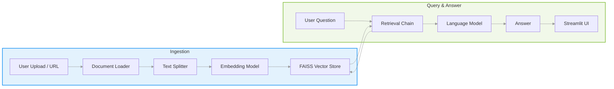

# RAG Q&A Chatbot

## Abstract
This repository implements a Retrieval-Augmented Generation (RAG) Q&A Chatbot using Streamlit for the user interface, FAISS as a vector store, and language models from OpenAI and HuggingFace. The system enables ingestion of documents or web pages, vector indexing, similarity-based retrieval, and context-aware answer generation.

## Features
- Upload individual files (PDF, TXT, CSV, JSON, DOCX) or ingest entire webpages via URL.
- Automatic text splitting and chunking of documents for efficient embedding.
- Embedding vectors generated with sentence-transformers/huggingface and OpenAI embedding models.
- FAISS vector store for rapid nearest-neighbor search.
- Retrieval chain combining document chunks and LLM to produce concise, context-aware answers.
- Streamlit interface for seamless interaction.

## Installation and Setup
1. Clone the repository:
   ```bash
   git clone https://github.com/your-org/your-repo.git
   cd your-repo
   ```
2. Create and activate a virtual environment:
   ```bash
   python3 -m venv venv
   source venv/bin/activate
   ```
3. Install dependencies:
   ```bash
   pip install -r requirements.txt
   ```
4. Create a `.env` file in the project root with the following variables:
   ```ini
   OPENAI_API_KEY=your_openai_api_key
   LANGCHAIN_API_KEY=your_langchain_api_key
   LANGCHAIN_PROJECT=your_langchain_project_name
   HF_TOKEN=your_huggingface_token
   ```

## Usage
Launch the Streamlit application:
```bash
streamlit run rag_app.py
```
1. Navigate to the web interface opened by Streamlit.
2. Upload files or enter a URL to ingest content into the vector store.
3. Enter your question in the chat box.
4. View the generated answer, which is based on retrieved context.

## Architecture Overview
Below is a high-level diagram illustrating the core workflow of the RAG Q&A Chatbot:



## License
This project is licensed under the MIT License. See [LICENSE](LICENSE) for details.

## Acknowledgements
This work leverages open-source libraries including:
- LangChain
- FAISS
- Streamlit
- OpenAI Python SDK
- HuggingFace sentence-transformers
