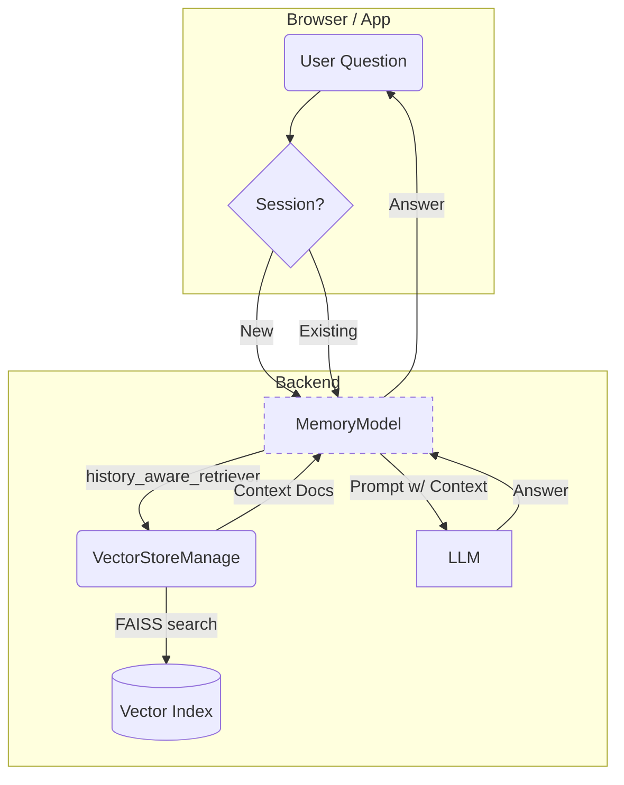
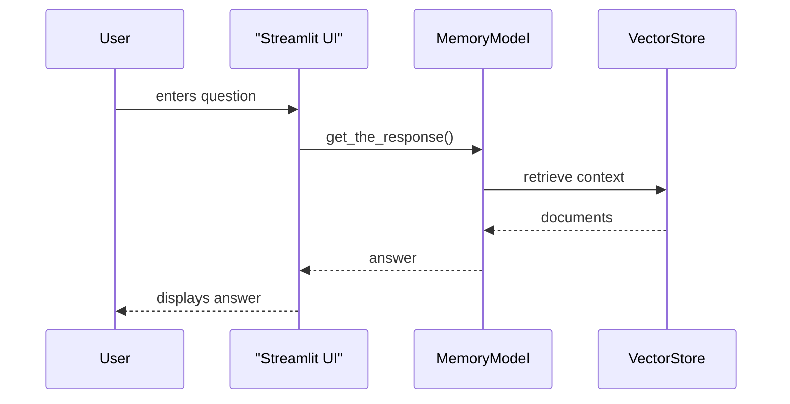

# Implementation Guide: Building a Sales-Person Chatbot with `VectorStoreManage` & `MemoryModel`

This guide walks you through the **end-to-end** process of integrating the utility classes shipped in `vs_utils` into a production-ready, retrieval-augmented **sales assistant**. By the end you will have a chatbot that can ingest product literature, answer customer queries with context, and remember past conversations across sessions.

> **Audience**: Data scientists / ML engineers familiar with Python and Large Language Models (LLMs).

---

## 1. System Overview



* **VectorStoreManage**: Handles document ingestion & FAISS retrieval.
* **MemoryModel**: Orchestrates the RAG loop and persists chat transcripts.
* **LLM**: Any Chat-style model (OpenAI, Anthropic, LLama-2, etc.).

---

## 2. Setup

1. **Clone** the repository & create a virtual environment
2. Install dependencies (see `requirements.txt`)
3. Export your API keys (`OPENAI_API_KEY`, optional `HF_TOKEN`)
4. Verify that `data/vector_store/` and `conversation_memory_data/` are writable.

```bash
python -m venv .venv
source .venv/bin/activate
pip install -r requirements.txt
cp .env.example .env   # fill with your credentials
```

---

## 3. Ingesting Product Data

### 3.1 Initialise the Vector Store

```python
from vs_utils.vector_store_manage import VectorStoreManage
vector_store = VectorStoreManage()  # uses defaults
```

### 3.2 Add Documents

```python
# PDFs
with open("catalogue.pdf", "rb") as f:
    vector_store.add_new_document(f)

# Web page (product landing page)
vector_store.add_new_document_from_url("https://my-shop.com/pricing")
```

All documents are **split**, **embedded**, and stored in FAISS automatically.

---

## 4. Creating a Memory-Aware Chat Engine

```python
from vs_utils.memory_model import MemoryModel
from langchain_openai import ChatOpenAI

memory = MemoryModel(
    llm_model=ChatOpenAI(model="gpt-4o-mini", temperature=0),
    vector_store_manage=vector_store
)
```

### 4.1 Starting a Session

```python
memory.new_session("Hi! What payment plans do you offer?")
```

### 4.2 Handling Subsequent Turns

```python
while True:
    user_query = input("Customer: ")
    answer = memory.get_the_response(user_query)
    print("Bot:", answer)
```

---

## 5. Front-End Options

### 5.1 Streamlit (rapid prototyping)



A fully-featured example (`rag_with_memory.py`) ships with the repo. Launch it:

```bash
streamlit run rag_with_memory.py
```

### 5.2 FastAPI (production)

```python
from fastapi import FastAPI, Depends
app = FastAPI()

# Dependency injection keeps globals clean

def get_memory():
    return MemoryModel(vector_store_manage=vector_store)

@app.post("/chat")
async def chat_endpoint(payload: dict, mm: MemoryModel = Depends(get_memory)):
    return {"answer": mm.get_the_response(payload["question"]) }
```

Deploy behind a reverse proxy (NGINX) or serverless function for scale.

---

## 6. Evaluation & Optimisation

* **Embeddings**: Experiment with `text-embedding-3-large` or HF models.
* **Chunk Size**: Tune `chunk_size` / `chunk_overlap` in `RecursiveCharacterTextSplitter`.
* **Retrieval k**: Adjust `search_kwargs={"k": 5}` for precision vs recall.
* **Prompt Engineering**: Customise `context_system_prompt` & `system_prompt` in `MemoryModel`.

---

## 7. Troubleshooting

| Symptom | Possible Cause | Fix |
|---------|----------------|-----|
| `ValueError: Vector store is empty` | No documents ingested | Run `add_new_document()` first |
| Responses ignore new files | Embedding dimensions mismatch | Ensure **same** `embedding_method` instance is shared |
| Chat history not saved | Read/write perms on `conversation_memory_data` | `chmod +rw` the directory |

---

## 8. Next Steps

1. Integrate **CRM data** for personalised up-sell.
2. Track **conversion metrics** via analytics hooks.
3. Fine-tune the LLM on historical sales chats (optional).

---

## 9. License & Citation

Released under MIT. Cite this repo if it contributes to your research or commercial product. 