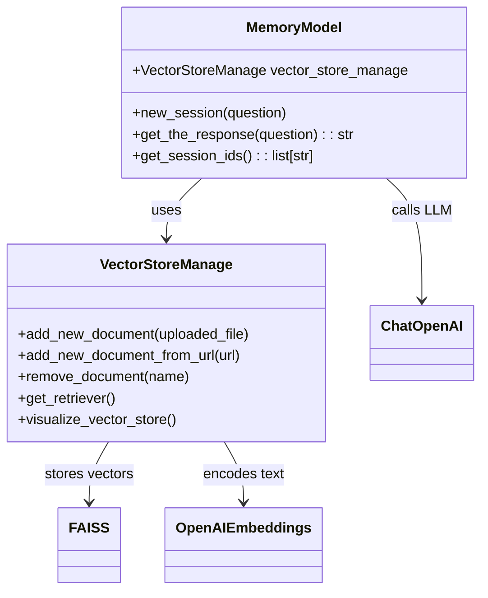
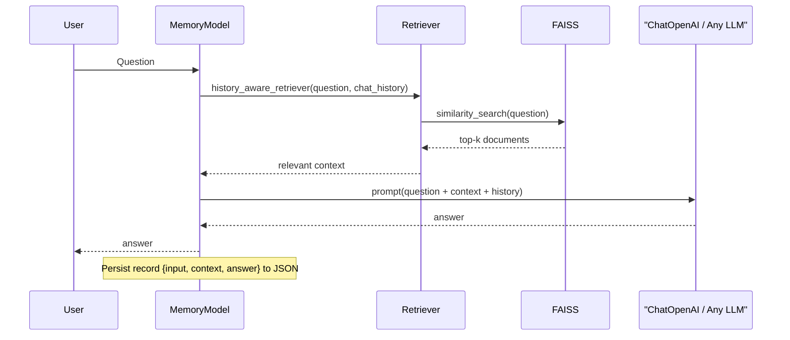

# Vector Store & Memory Model Utilities

This document provides an in-depth explanation of the two core utility classes contained in `vs_utils`—`VectorStoreManage` and `MemoryModel`. Together they enable a modern Retrieval-Augmented Generation (RAG) workflow in which external knowledge bases are embedded into a vector store (FAISS) and then queried in a conversational setting, with chat history automatically persisted for subsequent sessions.

---

## 1. Motivation

Large Language Models (LLMs) excel at reasoning over information that is explicitly provided **at inference time**. By combining:

1. *Vector similarity search* (to surface the most relevant passages) and
2. *Persistent session memory* (to keep track of earlier turns)

we obtain a chatbot that can answer domain-specific questions with context-aware, citation-rich responses.

---

## 2. High-Level Architecture





---

## 3. Prerequisites

* Python ≥ 3.10
* An **OpenAI** API key (or a HuggingFace token for local embeddings)

Create a virtual environment and install the core dependencies:

```bash
python -m venv .venv
source .venv/bin/activate
pip install -r requirements.txt        # Coming from your project root
```

Set the following environment variables (e.g. in a `.env` file):

```dotenv
OPENAI_API_KEY=sk-...
LANGCHAIN_API_KEY=<optional-for-LangSmith>
LANGCHAIN_PROJECT=<optional-project-name>
HF_TOKEN=<optional-huggingface-token>
```

---

## 4. `VectorStoreManage`

`VectorStoreManage` abstracts away all low-level operations related to ingesting and querying a FAISS index.

### 4.1 Instantiation

```python
from vs_utils.vector_store_manage import VectorStoreManage
from langchain_openai import ChatOpenAI, OpenAIEmbeddings

vector_store = VectorStoreManage(
    vector_store_path="data/vector_store",             # default path
    embedding_method=OpenAIEmbeddings(model="text-embedding-3-small"),
    llm_model=ChatOpenAI(model="gpt-4o-mini", temperature=0)
)
```

### 4.2 Adding Documents

```python
# 1) From a local file (pdf, txt, csv, json, docx)
with open("my_paper.pdf", "rb") as f:
    vector_store.add_new_document(f)

# 2) From a web URL
vector_store.add_new_document_from_url("https://arxiv.org/abs/2305.00001")
```

Supported formats and corresponding loaders are auto-detected; text is chunked with an overlap of 400 characters for smoother retrieval.

### 4.3 Retrieval & Maintenance

```python
# Similarity search retriever
retriever = vector_store.get_retriever()

# List all unique sources indexed so far
print(vector_store.get_list_of_documents())

# Remove a document and persist the new index
vector_store.remove_document("my_paper.pdf")
```

---

## 5. `MemoryModel`

`MemoryModel` orchestrates the entire RAG pipeline and stores structured chat transcripts in a JSON file (default: `conversation_memory_data/memory.json`).

### 5.1 Instantiation

```python
from vs_utils.memory_model import MemoryModel
from langchain_openai import ChatOpenAI

memory = MemoryModel(
    llm_model=ChatOpenAI(model="gpt-4o-mini", temperature=0),
    vector_store_manage=vector_store          # ensure same embedding dim
)
```

### 5.2 Starting a Session

```python
memory.new_session("How does the Transformer architecture work?")
```

The **first user question** acts as both the session ID and the initial chat turn.

### 5.3 Conversing

```python
response = memory.get_the_response("Explain positional encoding in two sentences.")
print(response)
```

Behind the scenes:

1. The previous chat history is flattened.
2. A *history-aware retriever* fetches the most relevant chunks via `vector_store_manage`.
3. The LLM (`gpt-4o-mini` by default) generates an answer conditioned on **system-prompts + context + history**.
4. The `{input, context, answer}` triple is appended to the JSON file for future retrieval.

You can list active sessions with `memory.get_session_ids()` or inspect the raw JSON via `memory.get_memory_json()`.

---

## 6. End-to-End Demo (Streamlit)

The repository ships with **`rag_with_memory.py`**, a ready-made Streamlit application that showcases file ingestion, RAG inference, and persistent multi-session chat. Launch it with:

```bash
streamlit run rag_with_memory.py
```

The sidebar lets you switch between *New* and *Existing* sessions, upload documents, or point the crawler to an arbitrary URL.

---

## 7. Extending the Utilities

* **Custom embeddings** — Swap `OpenAIEmbeddings` with any HuggingFace model by passing a compatible object at construction time.
* **Alternative vector stores** — While FAISS is the default, the same interface can be adapted for Pinecone, Chroma, etc.
* **Fine-grained memory** — The JSON schema is intentionally simple; feel free to add user IDs, timestamps, or external metadata.

---

## 8. License

These utilities are distributed under the MIT License. See `LICENSE` for full details.

---

*Happy hacking & may your vectors always be orthogonal!*
